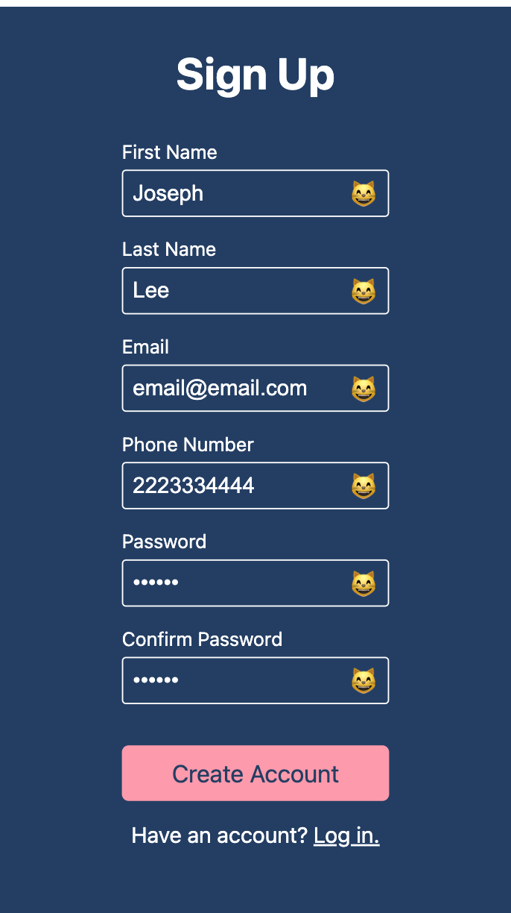

# Sign-up Form

My implementation of the sign-up form project for The Odin Project. Try it [here](https://jooo-lee.github.io/sign-up-form/)!

## Description:

This is a sign-up form for an imaginary service, created to help me practice my HTML, CSS and some JavaScript regarding HTML forms. 

For desktop and larger screens:

For mobile and smaller screens:

## Features:

* Client-side email validation using HTML
* Client-side phone number validation using regular expressions
* Password matching
* Display proper cat emoji to indicate validity/invalidity of input field to user
* Responsivity to varying screen sizes
* Clickable arrow for scroll to content on smaller screens

## I learned how to:

* Style a form
* Set custom validity messages on inputs using setCustomValidity() method
* Change grid template for CSS Grid based on screen size
* Scroll content into view using scrollIntoView() method
* Check for a match between regular expression and string
* Use CSS combinators such as adjacent and child combinators
* Create an infinite bouncing animation using keyframes
* Insert content into document using pseudo-elements such as ::before

## Acknowledgements:

[Photo](https://unsplash.com/photos/a-large-body-of-water-with-mountains-in-the-background-Z6RT0qH1Oec) by Marek Piwnicki on Unsplash.
[Favicon](https://icons8.com/icon/25055/mountain) by [Icons8](https://icons8.com)